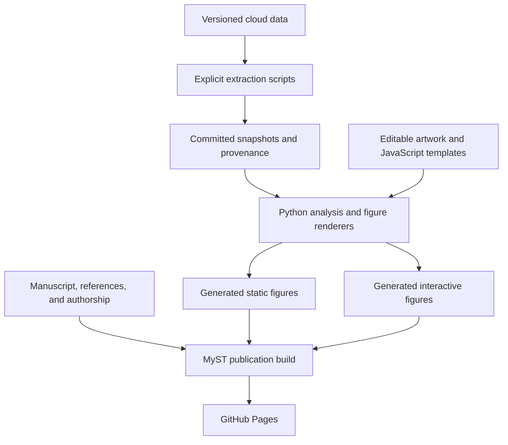

# Repository Map

This is a navigation guide to the OpenScope P3 data-release publication, based on the
repository inventory on 2026-10-08. It distinguishes project files from local environments,
caches, and deployment products. The detailed inventory below covers versioned project
files; local-only artwork is identified separately. It does not enumerate third-party
packages inside virtual environments, Git's internal objects, or MyST's build internals.

[README.md](../README.md) and [CONTRIBUTING.md](../CONTRIBUTING.md) remain authoritative
for setup, scientific provenance, contribution rules, and validation.

[index.md](../index.md) is the sole authoritative manuscript.

## How the Parts Connect

Ordinary figure builds use committed inputs rather than downloading primary NWB datasets.
Extraction and snapshot refreshes are separate, deliberate maintenance operations.

## Ownership Key

- **Editable source:** manuscript text, code, templates, configuration, or original artwork.
- **Snapshot:** a committed extract, intermediate, or provenance record. Refresh through its
  owning extractor or reviewed source process; do not casually change scientific values.
- **Generated:** an output of a builder or synchronization command. Change its owner and
  regenerate it rather than editing the output.
- **Imported:** preserved upstream material. Not necessarily the current manuscript or the
  current displayed figure; follow the manuscript's actual references.
- **Local/tool-owned:** development environments, caches, build products, or Git internals.

## Root Files

| File | What it does | Ownership |
| --- | --- | --- |
| [README.md](../README.md) | Project overview, quick start, validation commands, and publication URL. | Editable documentation |
| [CONTRIBUTING.md](../CONTRIBUTING.md) | Authoritative contribution workflow, provenance requirements, figure rules, binary-file policy, and checks. | Editable documentation |
| [CLAUDE.md](../CLAUDE.md) | Repository guidance for coding assistants, summarizing the authoritative documents. | Editable guidance |
| [index.md](../index.md) | Sole authoritative MyST manuscript: scientific text, figures, tables, captions, labels, and cross-references. | Editable manuscript |
| [references.bib](../references.bib) | Bibliographic records cited by the manuscript. | Editable source |
| [authors.yml](../authors.yml) | Portal-derived authors, affiliations, contributions, and related metadata consumed by the authorship plugin. | Generated; maintainer-only refresh |
| [author_portrait_sources.json](../author_portrait_sources.json) | Verified portrait source pages, image URLs, dimensions, and verification information. This is the editable portrait input. | Editable, source-backed manifest |
| [author_avatars.json](../author_avatars.json) | Generated avatar URL and source-provenance snapshot. Portrait images remain remotely hosted. | Generated; maintainer-only refresh |
| [myst.yml](../myst.yml) | Publication identity, bibliography, authorship plugin, table of contents, static assets, site theme, and style settings. | Editable configuration |
| [styles.css](../styles.css) | Publication-level styling, separate from individual figure-viewer stylesheets. | Editable source |
| [pyproject.toml](../pyproject.toml) | Python package metadata, dependencies, optional extras, build entry point, pytest settings, and Ruff rules. | Editable configuration |
| [uv.lock](../uv.lock) | Resolved Python dependency versions and distribution hashes used by locked installations. | Tool-maintained dependency lock |
| [.gitignore](../.gitignore) | Excludes build output, caches, selected deployment copies, and local environments from version control. | Editable configuration |
| [.gitattributes](../.gitattributes) | Git text/binary and line-ending rules, including LF preservation for checksum-sensitive files. | Editable configuration |

## Folder Overview

| Folder | What belongs here |
| --- | --- |
| `.claude/` | Project-local assistant skills. |
| `.github/` | GitHub Actions validation, publication, and snapshot-refresh workflows. |
| `docs/` | Maintainer references, scientific-method notes, and this navigation guide. |
| `figure_sources/` | Editable artwork, viewer templates, committed data, media, and provenance. |
| `images/figures/` | Static figures, divided into current generated assets and preserved imported images. |
| `interactive/` | Generated standalone HTML figures and their browser-facing supporting assets. |
| `scripts/` | Explicit extraction, synchronization, and maintenance commands. |
| `src/openscope_p3_publication/` | Installable Python package containing reusable analysis and renderers. |
| `tests/` | Analysis, provenance, manuscript, asset, and rendering regression tests. |

## Assistant Guidance and Automation

### `.claude/skills/`

Each subfolder contains one project-local assistant skill. These guide work on the
repository; they are not part of the scientific analysis or published website.

| File | What it does |
| --- | --- |
| [authoring-skills/SKILL.md](../.claude/skills/authoring-skills/SKILL.md) | Defines how to write and organize project-local skills. |
| [bash-safety/SKILL.md](../.claude/skills/bash-safety/SKILL.md) | Requires precautions around destructive shell operations and overwrites. |
| [prompting-conventions/SKILL.md](../.claude/skills/prompting-conventions/SKILL.md) | Guides task scoping, planning, acceptance criteria, and verification. |

### `.github/workflows/`

| File | What it does |
| --- | --- |
| [deploy.yml](../.github/workflows/deploy.yml) | Runs Linux validation and site assembly, Windows figure-reproducibility checks, and eligible main-branch GitHub Pages deployment. |
| [update-publication-snapshots.yml](../.github/workflows/update-publication-snapshots.yml) | Manually triggered workflow that downloads publication worksheet snapshots and commits selected refreshed files. Separate from authorship synchronization and the normal publication build. |

## `docs/`

These are maintainer and analysis references, not additional manuscript chapters in the
current MyST table of contents. Analysis planning notes should not be mistaken for
proof that every proposed change has been implemented.

| File | What it does |
| --- | --- |
| [bash-safety.md](bash-safety.md) | Detailed shell-safety reference supporting the corresponding skill. |
| [prompting-conventions.md](prompting-conventions.md) | Detailed guidance and examples for assigning work to coding agents. |
| [mismatch-responsiveness-definitions.md](mismatch-responsiveness-definitions.md) | Defines responsive-unit tests, context-specific windows, thresholds, and trial handling. |
| [neuropixels-area-label-provenance.md](neuropixels-area-label-provenance.md) | Documents NWB area labels, source revisions, coordinate interpretation, and anatomical cross-checks. |
| [neuropixels-mismatch-responsiveness.md](neuropixels-mismatch-responsiveness.md) | Detailed mismatch-response analysis plan, evidence, statistical decisions, and implementation considerations. |
| [repository-map.md](repository-map.md) | This folder/file navigation reference. |

## `src/openscope_p3_publication/`

This is the installable Python package. Analysis modules compute scientific quantities;
figure modules load committed inputs and produce publication artifacts. The command
`build-publication-figures` enters through `figures.main`.

| File | What it does |
| --- | --- |
| [__init__.py](../src/openscope_p3_publication/__init__.py) | Marks and initializes the Python package. |
| [authorship.py](../src/openscope_p3_publication/authorship.py) | Applies and validates explicitly reviewed authorship selections/corrections while preserving submitted records. |
| [figures.py](../src/openscope_p3_publication/figures.py) | Main build entry point, shared paths/styles/helpers, snapshot validation, and generators for design, inventory, hardware, behavior, raw data, segmentation, optotagging, yield, and trajectory figures. |
| [mismatch_adjacency.py](../src/openscope_p3_publication/mismatch_adjacency.py) | Analysis of neighboring/consecutive mismatch events and related trial timing. |
| [mismatch_adjacency_figure.py](../src/openscope_p3_publication/mismatch_adjacency_figure.py) | Turns the committed adjacency analysis into its supplementary static figure. |
| [mismatch_responsiveness.py](../src/openscope_p3_publication/mismatch_responsiveness.py) | Statistical machinery for mismatch responsiveness, including context-specific response comparisons. |
| [neural_responses.py](../src/openscope_p3_publication/neural_responses.py) | Reusable spike/event alignment, response-window, baseline, and spike-density calculations. |
| [neural_response_figure.py](../src/openscope_p3_publication/neural_response_figure.py) | Validates Neuropixels response snapshots, reads compressed response matrices, stages browser data, and renders static/interactive responses. |
| [optotagging.py](../src/openscope_p3_publication/optotagging.py) | Laser-pulse handling, peri-stimulus responses, unit statistics/classification inputs, and numeric heatmap-atlas construction. |
| [pupil_responses.py](../src/openscope_p3_publication/pupil_responses.py) | Reusable pupil/running signal alignment, baseline, quality-control, and response-summary calculations. |
| [pupil_figure.py](../src/openscope_p3_publication/pupil_figure.py) | Loads and validates the pupil-response intermediate, derives display summaries, and renders static/interactive panels. |
| [sensorimotor_running.py](../src/openscope_p3_publication/sensorimotor_running.py) | Analysis of locomotion and mismatch timing within sensorimotor sessions. |
| [sensorimotor_running_figure.py](../src/openscope_p3_publication/sensorimotor_running_figure.py) | Generates the sensorimotor-running static figure and HTML viewer. |
| [wavemap_figure.py](../src/openscope_p3_publication/wavemap_figure.py) | Orchestrates WaveMAP publication generation and supporting deployment assets from the committed snapshot. |
| [wavemap_publication_figures.py](../src/openscope_p3_publication/wavemap_publication_figures.py) | Builds the publication-ready WaveMAP static panels and composite outputs. |

## `scripts/`

These are explicit commands, not scripts that should all be run during setup. Many contact
cloud sources and can replace committed snapshots. Check their command-line options and
the contribution instructions before refreshing anything.

| File | What it does |
| --- | --- |
| [extract_behavior_excerpts.py](../scripts/extract_behavior_excerpts.py) | Extracts compact, synchronized behavior traces, stimulus rows, and camera timing references. |
| [extract_behavior_static_frames.py](../scripts/extract_behavior_static_frames.py) | Extracts representative camera stills and records their video/timing/display provenance. |
| [extract_experimental_sessions.py](../scripts/extract_experimental_sessions.py) | Normalizes session worksheet records, including modality, stimulus, and QC fields. |
| [extract_eye_tracking_excerpts.py](../scripts/extract_eye_tracking_excerpts.py) | Extracts synchronized eye-tracking examples from representative public NWBs. |
| [extract_hardware_powerpoint.py](../scripts/extract_hardware_powerpoint.py) | Extracts native images and placement metadata from the hardware PowerPoint source. |
| [extract_mismatch_adjacency.py](../scripts/extract_mismatch_adjacency.py) | Measures consecutive-mismatch adjacency across public Neuropixels recordings and writes the intermediate/provenance. |
| [extract_neuropixels_event_responses.py](../scripts/extract_neuropixels_event_responses.py) | Computes per-unit mismatch/control response summaries and compressed spike-density atlases from public NWBs. |
| [extract_neuropixels_trajectories.py](../scripts/extract_neuropixels_trajectories.py) | Extracts localized probe trajectories, anatomical profiles, and a compact CCF brain surface. |
| [extract_neuropixels_unit_yield.py](../scripts/extract_neuropixels_unit_yield.py) | Counts total and quality-filtered units per session and records source inventory/provenance. |
| [extract_optotagging_heatmaps.py](../scripts/extract_optotagging_heatmaps.py) | Produces optotagging heatmap data and session atlases from public NWBs. |
| [extract_optotagging_results.py](../scripts/extract_optotagging_results.py) | Computes per-unit optotagging statistics and writes Parquet results plus provenance. Its default output is an external staging directory. |
| [extract_optotagging_static_summary.py](../scripts/extract_optotagging_static_summary.py) | Recovers the plotted yield-summary values from the preserved legacy optotagging SVG. |
| [extract_pupil_event_responses.py](../scripts/extract_pupil_event_responses.py) | Computes event-aligned pupil and running summaries with quality control and source provenance. |
| [extract_raw_neural_excerpts.py](../scripts/extract_raw_neural_excerpts.py) | Extracts compact raw electrophysiology/imaging views; also has a scoped detector-only SLAP2 clip refresh. |
| [extract_raw_neural_static_frames.py](../scripts/extract_raw_neural_static_frames.py) | Produces deterministic microscopy stills; also supports the scoped SLAP2 acquisition-band products. |
| [extract_running_statistics.py](../scripts/extract_running_statistics.py) | Computes common running-speed summaries and example profiles across available modalities/sessions. |
| [extract_segmentation_viewers.py](../scripts/extract_segmentation_viewers.py) | Extracts unit/ROI/source segmentation payloads and images, with a separate registered-movie refresh mode. |
| [extract_sensorimotor_running.py](../scripts/extract_sensorimotor_running.py) | Extracts release-wide locomotion summaries for the sensorimotor mismatch block. |
| [extract_wavemap_analysis.py](../scripts/extract_wavemap_analysis.py) | Expensive WaveMAP extraction/analysis refresh, including waveform embedding/clustering and related analysis inputs. Not a routine renderer. |
| [generate_nwb_file_contents.py](../scripts/generate_nwb_file_contents.py) | Generates collapsible PyNWB file-contents HTML snapshots from pinned NWB assets. |
| [sync_authors.py](../scripts/sync_authors.py) | Maintainer-only portal synchronization for authorship and optional portrait refresh. Contributors should not run it. |
| [update_publication_snapshots.py](../scripts/update_publication_snapshots.py) | Refreshes the animal, session, and data-access worksheet snapshots and compatible dependent provenance. |
| [update_wavemap_provenance.py](../scripts/update_wavemap_provenance.py) | Verifies existing WaveMAP source-asset metadata without rerunning the scientific extraction or downloading full NWBs. |

## `tests/`

| File | What it tests |
| --- | --- |
| [test_figures.py](../tests/test_figures.py) | Shared and main figure generators, source checksums, figure data, layout/markup contracts, and optotagging calculations. |
| [test_mismatch_adjacency.py](../tests/test_mismatch_adjacency.py) | Mismatch adjacency analysis. |
| [test_mismatch_adjacency_figure.py](../tests/test_mismatch_adjacency_figure.py) | Adjacency snapshot and supplementary rendering. |
| [test_mismatch_responsiveness.py](../tests/test_mismatch_responsiveness.py) | Mismatch responsiveness calculations and statistical edge cases. |
| [test_neural_responses.py](../tests/test_neural_responses.py) | Neural event-response analysis, snapshot interpretation, and figure contracts. |
| [test_publication.py](../tests/test_publication.py) | Manuscript, authorship, imported sources, provenance, line endings, and workflow-level publication contracts. |
| [test_pupil_responses.py](../tests/test_pupil_responses.py) | Pupil/running event-response calculations and associated figure inputs. |
| [test_sensorimotor_running.py](../tests/test_sensorimotor_running.py) | Sensorimotor-running analysis. |
| [test_sensorimotor_running_figure.py](../tests/test_sensorimotor_running_figure.py) | Sensorimotor-running snapshot and rendered outputs. |
| [test_site_assets.py](../tests/test_site_assets.py) | Correct staging of canonical Neuropixels response media, including stale-copy removal. |
| [test_wavemap_figures.py](../tests/test_wavemap_figures.py) | WaveMAP source integrity, publication outputs, and figure contracts. |

## `figure_sources/data/`

Committed scientific and publication inputs. A paired `.provenance.json` records origin,
parameters, exclusions, dimensions, and/or checksums as appropriate to that product.
Some JSON payloads keep their provenance internally rather than in a separate file.

| Files | What they contain |
| --- | --- |
| [README.md](../figure_sources/data/README.md) | Data-product descriptions, scientific definitions, and refresh instructions. |
| [behavior-excerpts.json](../figure_sources/data/behavior-excerpts.json) | Compact synchronized behavior, stimulus, and camera-timing examples with source records. |
| [behavior-static-frames.provenance.json](../figure_sources/data/behavior-static-frames.provenance.json) | Source video, selected-frame, display-transform, and checksum records for behavior stills. |
| [data-access.csv](../figure_sources/data/data-access.csv), [data-access.provenance.json](../figure_sources/data/data-access.provenance.json) | Released-session identifiers and archive/S3 access links, plus worksheet provenance. |
| [experimental-animals.csv](../figure_sources/data/experimental-animals.csv), [experimental-animals.provenance.json](../figure_sources/data/experimental-animals.provenance.json) | Mouse metadata and its source worksheet/checksums. |
| [experimental-design-blocks.csv](../figure_sources/data/experimental-design-blocks.csv) | Structured protocol-block definitions for the design figure. |
| [experimental-design-sessions.csv](../figure_sources/data/experimental-design-sessions.csv) | Structured session/context definitions for the design figure. |
| [experimental-sessions.csv](../figure_sources/data/experimental-sessions.csv), [experimental-sessions.provenance.json](../figure_sources/data/experimental-sessions.provenance.json) | Complete normalized session worksheet, including repeated/aborted records and QC metadata, plus provenance. |
| [eye-tracking-excerpts.json](../figure_sources/data/eye-tracking-excerpts.json) | Compact eye-tracking examples and their source/timing metadata. |
| [mesoscope-laser-power.csv](../figure_sources/data/mesoscope-laser-power.csv) | Accessible transcription of the imported laser-power lookup-table image. |
| [mismatch-adjacency.json](../figure_sources/data/mismatch-adjacency.json), [mismatch-adjacency.provenance.json](../figure_sources/data/mismatch-adjacency.provenance.json) | Consecutive-mismatch timing/adjacency results and extraction provenance. |
| [neuropixels-event-responses.json](../figure_sources/data/neuropixels-event-responses.json), [neuropixels-event-responses.provenance.json](../figure_sources/data/neuropixels-event-responses.provenance.json) | Unit/event metadata and response-atlas interpretation, with source/code/output provenance. Bulk numeric matrices live under the matching media folder. |
| [neuropixels-mismatch-responsiveness.csv](../figure_sources/data/neuropixels-mismatch-responsiveness.csv) | Tabular Neuropixels mismatch-responsiveness results. |
| [neuropixels-trajectories.json](../figure_sources/data/neuropixels-trajectories.json), [neuropixels-trajectories.provenance.json](../figure_sources/data/neuropixels-trajectories.provenance.json) | Probe trajectories, area profiles, compact CCF surface, and source/exclusion records. |
| [neuropixels-unit-yield.csv](../figure_sources/data/neuropixels-unit-yield.csv), [neuropixels-unit-yield.provenance.json](../figure_sources/data/neuropixels-unit-yield.provenance.json) | Per-session total/QC-passing unit counts and archive/threshold provenance. |
| [optotagging-heatmaps.json](../figure_sources/data/optotagging-heatmaps.json), [optotagging-heatmaps.provenance.json](../figure_sources/data/optotagging-heatmaps.provenance.json) | Optotagging viewer metadata and atlas/source provenance. |
| [optotagging-results.parquet](../figure_sources/data/optotagging-results.parquet), [optotagging-results.provenance.json](../figure_sources/data/optotagging-results.provenance.json) | Historical per-unit optotagging statistics and their source/analysis provenance, not the viewer's full PSTH arrays. |
| [optotagging-static-summary.json](../figure_sources/data/optotagging-static-summary.json) | Numeric yield-summary values recovered from the legacy static plot. |
| [other-oddball-studies.csv](../figure_sources/data/other-oddball-studies.csv), [other-oddball-studies.provenance.json](../figure_sources/data/other-oddball-studies.provenance.json) | Literature-comparison table and source worksheet provenance. |
| [pupil-event-responses.json](../figure_sources/data/pupil-event-responses.json), [pupil-event-responses.provenance.json](../figure_sources/data/pupil-event-responses.provenance.json) | Peri-event pupil/running summaries, coverage, quality-control outcomes, and provenance. |
| [raw-neural-excerpts.json](../figure_sources/data/raw-neural-excerpts.json) | Compact raw electrophysiology/imaging excerpt metadata and scientific payloads with source records. |
| [raw-neural-static-frames.provenance.json](../figure_sources/data/raw-neural-static-frames.provenance.json) | Raw-viewer still-image source frames, transformations, and checksums. |
| [running-statistics.json](../figure_sources/data/running-statistics.json) | Cross-session running summaries, representative profiles, coverage/exclusions, calibration, and source manifests. |
| [segmentation-movies.json](../figure_sources/data/segmentation-movies.json) | Registered-movie and detector-only SLAP2 raw-clip manifest, including geometry, timing, and checksums. |
| [segmentation-viewers.json](../figure_sources/data/segmentation-viewers.json), [segmentation-viewers.provenance.json](../figure_sources/data/segmentation-viewers.provenance.json) | Unit/ROI/source masks, traces, metadata, compact recording excerpts, and extraction provenance. |
| [sensorimotor-running.json](../figure_sources/data/sensorimotor-running.json), [sensorimotor-running.provenance.json](../figure_sources/data/sensorimotor-running.provenance.json) | Locomotion summaries for sensorimotor mismatch sessions and their provenance. |
| [slap2-acquisition-bands.json](../figure_sources/data/slap2-acquisition-bands.json) | Acquisition-band/reference-image source records, geometry, and checksums. These are acquisition regions, not extracted-source masks. |
| [stimulus-viewer-sources.json](../figure_sources/data/stimulus-viewer-sources.json) | Pins the upstream stimulus implementation, examples, workflows, movie, checksums, and archive locations. |

### `figure_sources/data/nwb-file-contents/`

These are generated, committed PyNWB HTML fragments inserted into the NWB contents viewer.
They describe representative file organization rather than storing the NWBs themselves.

| File | What it describes |
| --- | --- |
| [mesoscope.html](../figure_sources/data/nwb-file-contents/mesoscope.html) | Representative mesoscope NWB object hierarchy. |
| [neuropixels.html](../figure_sources/data/nwb-file-contents/neuropixels.html) | Representative Neuropixels NWB object hierarchy. |
| [slap2.html](../figure_sources/data/nwb-file-contents/slap2.html) | Representative SLAP2 NWB object hierarchy. |

### `figure_sources/data/stimulus-table-excerpts/`

Source-row-preserving examples used by the stimulus viewer, not replacement full-session
recorded stimulus tables.

| File | What it contains |
| --- | --- |
| [duration_mismatch_example.csv](../figure_sources/data/stimulus-table-excerpts/duration_mismatch_example.csv) | Duration-mismatch example rows. |
| [sensorimotor_mismatch_example.csv](../figure_sources/data/stimulus-table-excerpts/sensorimotor_mismatch_example.csv) | Sensorimotor-mismatch example rows. |
| [sequence_mismatch_example.csv](../figure_sources/data/stimulus-table-excerpts/sequence_mismatch_example.csv) | Sequence-mismatch example rows. |
| [shared_blocks_example.csv](../figure_sources/data/stimulus-table-excerpts/shared_blocks_example.csv) | Shared control-block example rows. |
| [visual_mismatch_example.csv](../figure_sources/data/stimulus-table-excerpts/visual_mismatch_example.csv) | Standard visual-mismatch example rows. |
| [provenance.json](../figure_sources/data/stimulus-table-excerpts/provenance.json) | Pins excerpt origins, selected rows, and checksums. |

### `figure_sources/data/wavemap/`

| File | What it does |
| --- | --- |
| [README.md](../figure_sources/data/wavemap/README.md) | Explains the contributed snapshot, displayed populations, rendering, limitations, and refresh procedure. |
| [wavemap-analysis.json.gz](../figure_sources/data/wavemap/wavemap-analysis.json.gz) | Compressed, committed waveform-analysis snapshot used by static figures and interactive explorers. Routine builds do not recompute its embedding/clustering. |
| [wavemap-analysis.provenance.json](../figure_sources/data/wavemap/wavemap-analysis.provenance.json) | Source-asset inventory, checksums, metadata verification, and explicitly recorded provenance limitations. |

## Editable and Imported Figure Sources

### `figure_sources/derived/`

Deterministic crops retained with their provenance, not arbitrary hand-edited final images.

| File | What it does |
| --- | --- |
| [README.md](../figure_sources/derived/README.md) | Explains the crops and which former panels are now historical. |
| [cropped-figures.provenance.json](../figure_sources/derived/cropped-figures.provenance.json) | Source/output checksums, crop boxes, dimensions, and purposes. |
| [figure-02-experimental-design-cropped.png](../figure_sources/derived/figure-02-experimental-design-cropped.png) | Preserved experimental-design crop; its workflow artwork contributes to the composed overview. |
| [figure-04-multimodal-pipelines-no-traces.png](../figure_sources/derived/figure-04-multimodal-pipelines-no-traces.png) | Historical pipeline crop with the neural-traces column removed; the current hardware figure uses PowerPoint sources instead. |

### `figure_sources/google-doc/`

Figure provenance only. These records describe retained imported images; they are not an
alternate manuscript source or a manuscript import workflow.

| File | What it does |
| --- | --- |
| [README.md](../figure_sources/google-doc/README.md) | Explains the imported figure snapshots and missing/editable upstream-source links. |
| [manifest.json](../figure_sources/google-doc/manifest.json) | Preserved figure-origin records mapping original export names to retained images, labels, checksums, draft status, and available editable-source URLs. Validated by publication tests. |

### `figure_sources/google-slides/`

| File | What it does |
| --- | --- |
| [README.md](../figure_sources/google-slides/README.md) | Explains the linked analysis-map slide export. |
| [slide-15-neuropixels-implant.png](../figure_sources/google-slides/slide-15-neuropixels-implant.png) | Source-quality rendered slide of the Neuropixels implant/analysis map. |
| [slide-15-neuropixels-implant.provenance.json](../figure_sources/google-slides/slide-15-neuropixels-implant.provenance.json) | Slide/export URL, identifier, retrieval date, dimensions, and checksum. |

### `figure_sources/illustrator/`

`.ai` files are editable artwork. Their PNG companions are rendered inputs; provenance
connects them to the source files. Changing artwork requires refreshing its rendered
derivative and provenance as appropriate before rebuilding dependent figures.

| Files | What they do |
| --- | --- |
| [README.md](../figure_sources/illustrator/README.md) | Explains source ownership, platform marks, cohort diagrams, and typography. |
| [experimental-design-sources.provenance.json](../figure_sources/illustrator/experimental-design-sources.provenance.json) | Source/rendered checksums for the cohort and experimental-design panels. |
| [figure-01-panel-c-modality-cohorts.ai](../figure_sources/illustrator/figure-01-panel-c-modality-cohorts.ai) | Editable modality/cohort artwork for the overview's cohort panel. |
| [figure-01-panel-c-training-cohorts.ai](../figure_sources/illustrator/figure-01-panel-c-training-cohorts.ai) | Editable training/cohort artwork for the same design. |
| [figure4_predictive_processing_initial.ai](../figure_sources/illustrator/figure4_predictive_processing_initial.ai) | Original PDF-compatible predictive-processing concept artwork supplied from the perspective repository. |
| [figure-01-predictive-processing.png](../figure_sources/illustrator/figure-01-predictive-processing.png), [figure-01-predictive-processing.provenance.json](../figure_sources/illustrator/figure-01-predictive-processing.provenance.json) | Publication rendering of that concept artwork and its source/conversion provenance. |
| [figure-02-detailed-blocks.ai](../figure_sources/illustrator/figure-02-detailed-blocks.ai), [figure-02-detailed-blocks.png](../figure_sources/illustrator/figure-02-detailed-blocks.png) | Editable detailed control-block panel and its rendered input. |
| [figure-02-stimulus-timeline.ai](../figure_sources/illustrator/figure-02-stimulus-timeline.ai), [figure-02-stimulus-timeline.png](../figure_sources/illustrator/figure-02-stimulus-timeline.png) | Editable stimulus-timeline panel and its rendered input. |
| [mesoscope_logo.ai](../figure_sources/illustrator/mesoscope_logo.ai) | Editable mesoscope platform mark. |
| [neuropixel_logo.ai](../figure_sources/illustrator/neuropixel_logo.ai) | Editable Neuropixels platform mark. |
| [slap2_logo.ai](../figure_sources/illustrator/slap2_logo.ai) | Editable SLAP2 platform mark. |
| [platform-logos.provenance.json](../figure_sources/illustrator/platform-logos.provenance.json) | Connects the editable marks to their PNG derivatives and export/framing settings. |

Three additional Illustrator files were present but **untracked** during the inventory:

| Local-only path | Status |
| --- | --- |
| `figure_sources/illustrator/Figure 2.ai` | Local Illustrator artwork. Its intended relationship to the committed Figure 2 sources was not established. |
| `figure_sources/illustrator/Figure 3.ai` | Local Illustrator artwork. Its intended relationship to the committed hardware source was not established. |
| `figure_sources/illustrator/figure-01-vertical-design.ai` | Local Illustrator artwork. It is not automatically an input to the committed overview generator. |

These files were not opened, modified, added to Git, or treated as replacements for
existing sources by this inventory.

### `figure_sources/powerpoint/hardware/`

The PowerPoint is the editable hardware figure source. Its `images/` subfolder contains
nine native PNGs extracted from the presentation package, preserving the original image
bytes rather than using screenshots of the slide.

| File | What it does |
| --- | --- |
| [README.md](../figure_sources/powerpoint/hardware/README.md) | Describes the source deck, selected panels, native images, and extraction command. |
| [Presentation_ALL_HARDWARE.pptx](../figure_sources/powerpoint/hardware/Presentation_ALL_HARDWARE.pptx) | Editable hardware presentation; the rebuilt figure excludes its cohort column. |
| [provenance.json](../figure_sources/powerpoint/hardware/provenance.json) | Deck/image checksums, native package names, dimensions, slide placement, and cropping. |
| [images/mesoscope-brain-targeting.png](../figure_sources/powerpoint/hardware/images/mesoscope-brain-targeting.png) | Mesoscope brain-targeting panel image. |
| [images/mesoscope-mouse-platform.png](../figure_sources/powerpoint/hardware/images/mesoscope-mouse-platform.png) | Mesoscope mouse/platform panel image. |
| [images/mesoscope-rig-geometry.png](../figure_sources/powerpoint/hardware/images/mesoscope-rig-geometry.png) | Mesoscope rig-geometry panel image. |
| [images/neuropixels-brain-targeting.png](../figure_sources/powerpoint/hardware/images/neuropixels-brain-targeting.png) | Neuropixels brain-targeting panel image. |
| [images/neuropixels-mouse-platform.png](../figure_sources/powerpoint/hardware/images/neuropixels-mouse-platform.png) | Neuropixels mouse/platform panel image. |
| [images/neuropixels-rig-geometry.png](../figure_sources/powerpoint/hardware/images/neuropixels-rig-geometry.png) | Neuropixels rig-geometry panel image. |
| [images/slap2-brain-targeting.png](../figure_sources/powerpoint/hardware/images/slap2-brain-targeting.png) | SLAP2 brain-targeting panel image. |
| [images/slap2-mouse-platform.png](../figure_sources/powerpoint/hardware/images/slap2-mouse-platform.png) | SLAP2 mouse/platform panel image. |
| [images/slap2-rig-geometry.png](../figure_sources/powerpoint/hardware/images/slap2-rig-geometry.png) | SLAP2 rig-geometry panel image. |

### `figure_sources/python/`

| File | What it does |
| --- | --- |
| [README.md](../figure_sources/python/README.md) | Explains Python-generated figures, their inputs, and the build command. |
| [wavemap_rendering.py](../figure_sources/python/wavemap_rendering.py) | Editable contributed WaveMAP plotting program, including panel plots and interactive explorers. It expects tables/configuration injected by the publication builder, rather than acting as a standalone extraction command. |

## `figure_sources/javascript/`

These files are editable viewer sources. For every three-file row below, **HTML** supplies
the page structure and scientific legend, **CSS** supplies layout/styling, and
**JavaScript** supplies rendering, controls, and state. The Python builders inline them
with data into generated files under `interactive/`.

| Viewer | HTML | CSS | JavaScript | What the viewer does |
| --- | --- | --- | --- | --- |
| Behavior | [behavior-viewer.html](../figure_sources/javascript/behavior-viewer.html) | [behavior-viewer.css](../figure_sources/javascript/behavior-viewer.css) | [behavior-viewer.js](../figure_sources/javascript/behavior-viewer.js) | Synchronized camera video, stimulus, and wheel/running traces. |
| Data explorer | [data-explorer.html](../figure_sources/javascript/data-explorer.html) | [data-explorer.css](../figure_sources/javascript/data-explorer.css) | [data-explorer.js](../figure_sources/javascript/data-explorer.js) | Search/filter animal and session records and export CSV data. |
| Eye tracking | [eye-tracking-viewer.html](../figure_sources/javascript/eye-tracking-viewer.html) | [eye-tracking-viewer.css](../figure_sources/javascript/eye-tracking-viewer.css) | [eye-tracking-viewer.js](../figure_sources/javascript/eye-tracking-viewer.js) | Inspect synchronized eye-tracking examples. |
| Literature | [literature-comparison.html](../figure_sources/javascript/literature-comparison.html) | [literature-comparison.css](../figure_sources/javascript/literature-comparison.css) | [literature-comparison.js](../figure_sources/javascript/literature-comparison.js) | Browse the oddball-study comparison table. |
| Raw neural data | [neural-viewer.html](../figure_sources/javascript/neural-viewer.html) | [neural-viewer.css](../figure_sources/javascript/neural-viewer.css) | [neural-viewer.js](../figure_sources/javascript/neural-viewer.js) | Browse raw AP/imaging excerpts and associated extraction views. |
| Neural responses | [neuropixels-event-responses.html](../figure_sources/javascript/neuropixels-event-responses.html) | [neuropixels-event-responses.css](../figure_sources/javascript/neuropixels-event-responses.css) | [neuropixels-event-responses.js](../figure_sources/javascript/neuropixels-event-responses.js) | Filter units/areas/types and inspect mismatch/control heatmaps and spike-density functions. |
| Probe trajectories | [neuropixels-trajectories.html](../figure_sources/javascript/neuropixels-trajectories.html) | [neuropixels-trajectories.css](../figure_sources/javascript/neuropixels-trajectories.css) | [neuropixels-trajectories.js](../figure_sources/javascript/neuropixels-trajectories.js) | Explore probe insertions and anatomy in a Three.js CCF scene. |
| NWB contents | [nwb-file-contents.html](../figure_sources/javascript/nwb-file-contents.html) | [nwb-file-contents.css](../figure_sources/javascript/nwb-file-contents.css) | [nwb-file-contents.js](../figure_sources/javascript/nwb-file-contents.js) | Switch between representative modality-specific NWB file hierarchies. |
| Optotagging | [optotagging-heatmaps.html](../figure_sources/javascript/optotagging-heatmaps.html) | [optotagging-heatmaps.css](../figure_sources/javascript/optotagging-heatmaps.css) | [optotagging-heatmaps.js](../figure_sources/javascript/optotagging-heatmaps.js) | Inspect laser-response heatmaps and optotagging summaries. |
| Pupil responses | [pupil-event-responses.html](../figure_sources/javascript/pupil-event-responses.html) | [pupil-event-responses.css](../figure_sources/javascript/pupil-event-responses.css) | [pupil-event-responses.js](../figure_sources/javascript/pupil-event-responses.js) | Explore event-aligned pupil/running responses across contexts, cohorts, and mice. |
| Segmentation | [segmentation-viewer.html](../figure_sources/javascript/segmentation-viewer.html) | [segmentation-viewer.css](../figure_sources/javascript/segmentation-viewer.css) | [segmentation-viewer.js](../figure_sources/javascript/segmentation-viewer.js) | Inspect unit templates, imaging masks, registered clips, and extracted traces. |
| Sensorimotor running | [sensorimotor-running.html](../figure_sources/javascript/sensorimotor-running.html) | [sensorimotor-running.css](../figure_sources/javascript/sensorimotor-running.css) | [sensorimotor-running.js](../figure_sources/javascript/sensorimotor-running.js) | Explore locomotion during sensorimotor mismatch blocks. |
| Stimulus/design | [stimulus-viewer.html](../figure_sources/javascript/stimulus-viewer.html) | [stimulus-viewer.css](../figure_sources/javascript/stimulus-viewer.css) | [stimulus-viewer.js](../figure_sources/javascript/stimulus-viewer.js) | Play source-backed stimulus rows and show session/control architecture. Generates the experimental-design page. |
| Unit yield | [unit-yield.html](../figure_sources/javascript/unit-yield.html) | [unit-yield.css](../figure_sources/javascript/unit-yield.css) | [unit-yield.js](../figure_sources/javascript/unit-yield.js) | Explore per-session Neuropixels unit yield. |
| WaveMAP wrapper | [wavemap-supplement.html](../figure_sources/javascript/wavemap-supplement.html) | [wavemap-supplement.css](../figure_sources/javascript/wavemap-supplement.css) | [wavemap-supplement.js](../figure_sources/javascript/wavemap-supplement.js) | Hosts the static WaveMAP counterpart and its interactive analysis tabs. |

| Shared file | What it does |
| --- | --- |
| [README.md](../figure_sources/javascript/README.md) | Viewer-source conventions, ownership, build behavior, and selected data-flow details. |
| [embed-auto-height.js](../figure_sources/javascript/embed-auto-height.js) | Resizes same-origin publication iframe wrappers to their content. |
| [figure-legend.js](../figure_sources/javascript/figure-legend.js) | Shared legend disclosure, keyboard/Escape handling, and closing on Static selection. |
| [figure-legend.css](../figure_sources/javascript/figure-legend.css) | Shared toolbar and legend-control styling. |
| [figure-typography.css](../figure_sources/javascript/figure-typography.css) | Shared figure text roles and sizes. |

## `figure_sources/media/`

Compact, committed display inputs and preserved source assets. They are not full primary
recordings. Image/movie provenance lives in the corresponding data manifest unless a
local provenance file is listed. Do not infer registration, timing, or biological meaning
from filenames alone; the manifests define those details.

### Shared Stimulus Media

| File | What it does |
| --- | --- |
| [README.md](../figure_sources/media/README.md) | Explains the stimulus excerpt, poster, and provenance. |
| [zebra-stimulus-excerpt.m4v](../figure_sources/media/zebra-stimulus-excerpt.m4v) | Canonical compact excerpt of the pinned stimulus movie, copied beside the generated stimulus viewer. |
| [zebra-stimulus-poster.png](../figure_sources/media/zebra-stimulus-poster.png) | Poster frame from that excerpt. |
| [zebra-stimulus-excerpt.provenance.json](../figure_sources/media/zebra-stimulus-excerpt.provenance.json) | Source URL, source/derived checksums, conversion settings, and dimensions. |

### `figure_sources/media/behavior-viewer-static/`

Selected camera stills for the static behavior figure. The paired data-folder provenance
records source sessions, cameras, times, image adjustments, and checksums.

| File | Camera view |
| --- | --- |
| [mesoscope-behavior.jpg](../figure_sources/media/behavior-viewer-static/mesoscope-behavior.jpg) | Mesoscope behavior camera. |
| [mesoscope-eye.jpg](../figure_sources/media/behavior-viewer-static/mesoscope-eye.jpg) | Mesoscope eye camera. |
| [mesoscope-face.jpg](../figure_sources/media/behavior-viewer-static/mesoscope-face.jpg) | Mesoscope face camera. |
| [mesoscope-nose.jpg](../figure_sources/media/behavior-viewer-static/mesoscope-nose.jpg) | Mesoscope nose camera. |
| [neuropixels-behavior.jpg](../figure_sources/media/behavior-viewer-static/neuropixels-behavior.jpg) | Neuropixels behavior camera. |
| [neuropixels-eye.jpg](../figure_sources/media/behavior-viewer-static/neuropixels-eye.jpg) | Neuropixels eye camera. |
| [neuropixels-face.jpg](../figure_sources/media/behavior-viewer-static/neuropixels-face.jpg) | Neuropixels face camera. |
| [slap2-body.jpg](../figure_sources/media/behavior-viewer-static/slap2-body.jpg) | SLAP2 body camera. |
| [slap2-eye.jpg](../figure_sources/media/behavior-viewer-static/slap2-eye.jpg) | SLAP2 eye camera. |
| [slap2-face.jpg](../figure_sources/media/behavior-viewer-static/slap2-face.jpg) | SLAP2 face camera. |

### `figure_sources/media/neural-viewer-static/`

Extracted microscopy stills retained with frame/transform provenance. The mesoscope
suffix identifies a plane; the SLAP2 suffix identifies a DMD field. These are distinct
from the registered segmentation backgrounds and detector-only raw clips below.

| File | Static input |
| --- | --- |
| [mesoscope-visl_4.png](../figure_sources/media/neural-viewer-static/mesoscope-visl_4.png) | Mesoscope VISl plane 4 still. |
| [mesoscope-visl_5.png](../figure_sources/media/neural-viewer-static/mesoscope-visl_5.png) | Mesoscope VISl plane 5 still. |
| [mesoscope-visl_6.png](../figure_sources/media/neural-viewer-static/mesoscope-visl_6.png) | Mesoscope VISl plane 6 still. |
| [mesoscope-visl_7.png](../figure_sources/media/neural-viewer-static/mesoscope-visl_7.png) | Mesoscope VISl plane 7 still. |
| [mesoscope-visp_0.png](../figure_sources/media/neural-viewer-static/mesoscope-visp_0.png) | Mesoscope VISp plane 0 still. |
| [mesoscope-visp_1.png](../figure_sources/media/neural-viewer-static/mesoscope-visp_1.png) | Mesoscope VISp plane 1 still. |
| [mesoscope-visp_2.png](../figure_sources/media/neural-viewer-static/mesoscope-visp_2.png) | Mesoscope VISp plane 2 still. |
| [mesoscope-visp_3.png](../figure_sources/media/neural-viewer-static/mesoscope-visp_3.png) | Mesoscope VISp plane 3 still. |
| [slap2-dmd1-composite.png](../figure_sources/media/neural-viewer-static/slap2-dmd1-composite.png) | Preserved SLAP2 DMD1 composite still. |
| [slap2-dmd2-composite.png](../figure_sources/media/neural-viewer-static/slap2-dmd2-composite.png) | Preserved SLAP2 DMD2 composite still. |

### Raw Excerpt Sprite Sheets

The source folder is `figure_sources/media/neural-viewer/`; the paired browser copies
are under `interactive/media/neural-viewer/`. Each WebP stores compact excerpt frames
for playback. The older SLAP2 sheets include reference/composite products; the current
detector-only raw clips have separate entries under `segmentation-movies/`.

| Source asset | Generated browser copy | Content |
| --- | --- | --- |
| [mesoscope-visl-4.webp](../figure_sources/media/neural-viewer/mesoscope-visl-4.webp) | [mesoscope-visl-4.webp](../interactive/media/neural-viewer/mesoscope-visl-4.webp) | VISl plane 4 excerpt. |
| [mesoscope-visl-5.webp](../figure_sources/media/neural-viewer/mesoscope-visl-5.webp) | [mesoscope-visl-5.webp](../interactive/media/neural-viewer/mesoscope-visl-5.webp) | VISl plane 5 excerpt. |
| [mesoscope-visl-6.webp](../figure_sources/media/neural-viewer/mesoscope-visl-6.webp) | [mesoscope-visl-6.webp](../interactive/media/neural-viewer/mesoscope-visl-6.webp) | VISl plane 6 excerpt. |
| [mesoscope-visl-7.webp](../figure_sources/media/neural-viewer/mesoscope-visl-7.webp) | [mesoscope-visl-7.webp](../interactive/media/neural-viewer/mesoscope-visl-7.webp) | VISl plane 7 excerpt. |
| [mesoscope-visp-0.webp](../figure_sources/media/neural-viewer/mesoscope-visp-0.webp) | [mesoscope-visp-0.webp](../interactive/media/neural-viewer/mesoscope-visp-0.webp) | VISp plane 0 excerpt. |
| [mesoscope-visp-1.webp](../figure_sources/media/neural-viewer/mesoscope-visp-1.webp) | [mesoscope-visp-1.webp](../interactive/media/neural-viewer/mesoscope-visp-1.webp) | VISp plane 1 excerpt. |
| [mesoscope-visp-2.webp](../figure_sources/media/neural-viewer/mesoscope-visp-2.webp) | [mesoscope-visp-2.webp](../interactive/media/neural-viewer/mesoscope-visp-2.webp) | VISp plane 2 excerpt. |
| [mesoscope-visp-3.webp](../figure_sources/media/neural-viewer/mesoscope-visp-3.webp) | [mesoscope-visp-3.webp](../interactive/media/neural-viewer/mesoscope-visp-3.webp) | VISp plane 3 excerpt. |
| [slap2-dmd1-composite.webp](../figure_sources/media/neural-viewer/slap2-dmd1-composite.webp) | [slap2-dmd1-composite.webp](../interactive/media/neural-viewer/slap2-dmd1-composite.webp) | Preserved DMD1 composite excerpt. |
| [slap2-dmd1-detector-1.webp](../figure_sources/media/neural-viewer/slap2-dmd1-detector-1.webp) | [slap2-dmd1-detector-1.webp](../interactive/media/neural-viewer/slap2-dmd1-detector-1.webp) | Preserved DMD1 detector 1 excerpt. |
| [slap2-dmd1-detector-2.webp](../figure_sources/media/neural-viewer/slap2-dmd1-detector-2.webp) | [slap2-dmd1-detector-2.webp](../interactive/media/neural-viewer/slap2-dmd1-detector-2.webp) | Preserved DMD1 detector 2 excerpt. |
| [slap2-dmd2-composite.webp](../figure_sources/media/neural-viewer/slap2-dmd2-composite.webp) | [slap2-dmd2-composite.webp](../interactive/media/neural-viewer/slap2-dmd2-composite.webp) | Preserved DMD2 composite excerpt. |
| [slap2-dmd2-detector-1.webp](../figure_sources/media/neural-viewer/slap2-dmd2-detector-1.webp) | [slap2-dmd2-detector-1.webp](../interactive/media/neural-viewer/slap2-dmd2-detector-1.webp) | Preserved DMD2 detector 1 excerpt. |
| [slap2-dmd2-detector-2.webp](../figure_sources/media/neural-viewer/slap2-dmd2-detector-2.webp) | [slap2-dmd2-detector-2.webp](../interactive/media/neural-viewer/slap2-dmd2-detector-2.webp) | Preserved DMD2 detector 2 excerpt. |

### `figure_sources/media/neuropixels-event-responses/`

Gzip-compressed unsigned-16-bit numeric spike-density matrices, not pictures. The matching
JSON data product specifies shape, scaling, units, and event/unit ordering. Builds copy
these files into the ignored browser deployment folder of the same name.

| File | Response context |
| --- | --- |
| [duration-sdf-mean.u16.gz](../figure_sources/media/neuropixels-event-responses/duration-sdf-mean.u16.gz) | Duration mismatch/control mean spike-density functions. |
| [motor-sdf-mean.u16.gz](../figure_sources/media/neuropixels-event-responses/motor-sdf-mean.u16.gz) | Sensorimotor mismatch/control mean spike-density functions. |
| [sequence-sdf-mean.u16.gz](../figure_sources/media/neuropixels-event-responses/sequence-sdf-mean.u16.gz) | Sequence mismatch/control mean spike-density functions. |
| [standard-sdf-mean.u16.gz](../figure_sources/media/neuropixels-event-responses/standard-sdf-mean.u16.gz) | Standard-oddball mismatch/control mean spike-density functions. |

### `figure_sources/media/optotagging/`

The paired session files provide atlas data/metadata in JSON and its image representation
in PNG. Their exact dimensions, interpretation, and source checksums are defined by the
optotagging manifests.

| Files | What they do |
| --- | --- |
| [ecephys_830851_2026-03-19_10-49-11.atlas.json](../figure_sources/media/optotagging/ecephys_830851_2026-03-19_10-49-11.atlas.json), [ecephys_830851_2026-03-19_10-49-11.atlas.png](../figure_sources/media/optotagging/ecephys_830851_2026-03-19_10-49-11.atlas.png) | Atlas data and image for the named mouse/session. |
| [ecephys_832691_2026-03-24_10-04-30.atlas.json](../figure_sources/media/optotagging/ecephys_832691_2026-03-24_10-04-30.atlas.json), [ecephys_832691_2026-03-24_10-04-30.atlas.png](../figure_sources/media/optotagging/ecephys_832691_2026-03-24_10-04-30.atlas.png) | Atlas data and image for the named mouse/session. |
| [ecephys_848390_2026-05-06_09-54-56.atlas.json](../figure_sources/media/optotagging/ecephys_848390_2026-05-06_09-54-56.atlas.json), [ecephys_848390_2026-05-06_09-54-56.atlas.png](../figure_sources/media/optotagging/ecephys_848390_2026-05-06_09-54-56.atlas.png) | Atlas data and image for the named mouse/session. |
| [optotagging-static-composite.svg](../figure_sources/media/optotagging/optotagging-static-composite.svg) | Generated composite used in the static optotagging publication output. Although located under source media, it is builder-owned. |
| [optotagging-static-legacy.svg](../figure_sources/media/optotagging/optotagging-static-legacy.svg) | Preserved legacy plot from which the numeric static-summary values are recovered. |

### `figure_sources/media/platform-logos/`

Rendered transparent platform marks derived from the corresponding Illustrator sources.

| File | Platform |
| --- | --- |
| [mesoscope.png](../figure_sources/media/platform-logos/mesoscope.png) | Mesoscope. |
| [neuropixels.png](../figure_sources/media/platform-logos/neuropixels.png) | Neuropixels. |
| [slap2.png](../figure_sources/media/platform-logos/slap2.png) | SLAP2. |

### `figure_sources/media/segmentation-movies/`

Committed compact clips. Registered clips supply backgrounds for matching segmentation
masks. The four `-raw` clips are detector-only SLAP2 acquisitions with a different
coordinate/display contract; registered masks must not be overlaid on them. The build
stages same-named copies under ignored `interactive/media/segmentation-movies/`.

| File | Content |
| --- | --- |
| [mesoscope-visl_4.webp](../figure_sources/media/segmentation-movies/mesoscope-visl_4.webp) | Registered VISl plane 4 clip. |
| [mesoscope-visl_5.webp](../figure_sources/media/segmentation-movies/mesoscope-visl_5.webp) | Registered VISl plane 5 clip. |
| [mesoscope-visl_6.webp](../figure_sources/media/segmentation-movies/mesoscope-visl_6.webp) | Registered VISl plane 6 clip. |
| [mesoscope-visl_7.webp](../figure_sources/media/segmentation-movies/mesoscope-visl_7.webp) | Registered VISl plane 7 clip. |
| [mesoscope-visp_0.webp](../figure_sources/media/segmentation-movies/mesoscope-visp_0.webp) | Registered VISp plane 0 clip. |
| [mesoscope-visp_1.webp](../figure_sources/media/segmentation-movies/mesoscope-visp_1.webp) | Registered VISp plane 1 clip. |
| [mesoscope-visp_2.webp](../figure_sources/media/segmentation-movies/mesoscope-visp_2.webp) | Registered VISp plane 2 clip. |
| [mesoscope-visp_3.webp](../figure_sources/media/segmentation-movies/mesoscope-visp_3.webp) | Registered VISp plane 3 clip. |
| [slap2-dmd1.webp](../figure_sources/media/segmentation-movies/slap2-dmd1.webp) | Registered SLAP2 DMD1 clip. |
| [slap2-dmd2.webp](../figure_sources/media/segmentation-movies/slap2-dmd2.webp) | Registered SLAP2 DMD2 clip. |
| [slap2-dmd1-detector-1-raw.webp](../figure_sources/media/segmentation-movies/slap2-dmd1-detector-1-raw.webp) | Raw DMD1 detector 1 clip. |
| [slap2-dmd1-detector-2-raw.webp](../figure_sources/media/segmentation-movies/slap2-dmd1-detector-2-raw.webp) | Raw DMD1 detector 2 clip. |
| [slap2-dmd2-detector-1-raw.webp](../figure_sources/media/segmentation-movies/slap2-dmd2-detector-1-raw.webp) | Raw DMD2 detector 1 clip. |
| [slap2-dmd2-detector-2-raw.webp](../figure_sources/media/segmentation-movies/slap2-dmd2-detector-2-raw.webp) | Raw DMD2 detector 2 clip. |

### Segmentation Images

Sources live under `figure_sources/media/segmentation-viewers/`; paired browser copies
live under `interactive/media/segmentation-viewers/`. For each plane/DMD, `filters`
provides the source-filter/mask visualization, `labels` provides the label image, and
`mean` provides the mean/reference background. The JSON manifest supplies scientific
identities, geometry, transforms, traces, and checksums.

| Source image | Generated browser copy | Role |
| --- | --- | --- |
| [mesoscope-visl-4-filters.png](../figure_sources/media/segmentation-viewers/mesoscope-visl-4-filters.png) | [mesoscope-visl-4-filters.png](../interactive/media/segmentation-viewers/mesoscope-visl-4-filters.png) | VISl 4 filters. |
| [mesoscope-visl-4-labels.png](../figure_sources/media/segmentation-viewers/mesoscope-visl-4-labels.png) | [mesoscope-visl-4-labels.png](../interactive/media/segmentation-viewers/mesoscope-visl-4-labels.png) | VISl 4 labels. |
| [mesoscope-visl-4-mean.png](../figure_sources/media/segmentation-viewers/mesoscope-visl-4-mean.png) | [mesoscope-visl-4-mean.png](../interactive/media/segmentation-viewers/mesoscope-visl-4-mean.png) | VISl 4 background. |
| [mesoscope-visl-5-filters.png](../figure_sources/media/segmentation-viewers/mesoscope-visl-5-filters.png) | [mesoscope-visl-5-filters.png](../interactive/media/segmentation-viewers/mesoscope-visl-5-filters.png) | VISl 5 filters. |
| [mesoscope-visl-5-labels.png](../figure_sources/media/segmentation-viewers/mesoscope-visl-5-labels.png) | [mesoscope-visl-5-labels.png](../interactive/media/segmentation-viewers/mesoscope-visl-5-labels.png) | VISl 5 labels. |
| [mesoscope-visl-5-mean.png](../figure_sources/media/segmentation-viewers/mesoscope-visl-5-mean.png) | [mesoscope-visl-5-mean.png](../interactive/media/segmentation-viewers/mesoscope-visl-5-mean.png) | VISl 5 background. |
| [mesoscope-visl-6-filters.png](../figure_sources/media/segmentation-viewers/mesoscope-visl-6-filters.png) | [mesoscope-visl-6-filters.png](../interactive/media/segmentation-viewers/mesoscope-visl-6-filters.png) | VISl 6 filters. |
| [mesoscope-visl-6-labels.png](../figure_sources/media/segmentation-viewers/mesoscope-visl-6-labels.png) | [mesoscope-visl-6-labels.png](../interactive/media/segmentation-viewers/mesoscope-visl-6-labels.png) | VISl 6 labels. |
| [mesoscope-visl-6-mean.png](../figure_sources/media/segmentation-viewers/mesoscope-visl-6-mean.png) | [mesoscope-visl-6-mean.png](../interactive/media/segmentation-viewers/mesoscope-visl-6-mean.png) | VISl 6 background. |
| [mesoscope-visl-7-filters.png](../figure_sources/media/segmentation-viewers/mesoscope-visl-7-filters.png) | [mesoscope-visl-7-filters.png](../interactive/media/segmentation-viewers/mesoscope-visl-7-filters.png) | VISl 7 filters. |
| [mesoscope-visl-7-labels.png](../figure_sources/media/segmentation-viewers/mesoscope-visl-7-labels.png) | [mesoscope-visl-7-labels.png](../interactive/media/segmentation-viewers/mesoscope-visl-7-labels.png) | VISl 7 labels. |
| [mesoscope-visl-7-mean.png](../figure_sources/media/segmentation-viewers/mesoscope-visl-7-mean.png) | [mesoscope-visl-7-mean.png](../interactive/media/segmentation-viewers/mesoscope-visl-7-mean.png) | VISl 7 background. |
| [mesoscope-visp-0-filters.png](../figure_sources/media/segmentation-viewers/mesoscope-visp-0-filters.png) | [mesoscope-visp-0-filters.png](../interactive/media/segmentation-viewers/mesoscope-visp-0-filters.png) | VISp 0 filters. |
| [mesoscope-visp-0-labels.png](../figure_sources/media/segmentation-viewers/mesoscope-visp-0-labels.png) | [mesoscope-visp-0-labels.png](../interactive/media/segmentation-viewers/mesoscope-visp-0-labels.png) | VISp 0 labels. |
| [mesoscope-visp-0-mean.png](../figure_sources/media/segmentation-viewers/mesoscope-visp-0-mean.png) | [mesoscope-visp-0-mean.png](../interactive/media/segmentation-viewers/mesoscope-visp-0-mean.png) | VISp 0 background. |
| [mesoscope-visp-1-filters.png](../figure_sources/media/segmentation-viewers/mesoscope-visp-1-filters.png) | [mesoscope-visp-1-filters.png](../interactive/media/segmentation-viewers/mesoscope-visp-1-filters.png) | VISp 1 filters. |
| [mesoscope-visp-1-labels.png](../figure_sources/media/segmentation-viewers/mesoscope-visp-1-labels.png) | [mesoscope-visp-1-labels.png](../interactive/media/segmentation-viewers/mesoscope-visp-1-labels.png) | VISp 1 labels. |
| [mesoscope-visp-1-mean.png](../figure_sources/media/segmentation-viewers/mesoscope-visp-1-mean.png) | [mesoscope-visp-1-mean.png](../interactive/media/segmentation-viewers/mesoscope-visp-1-mean.png) | VISp 1 background. |
| [mesoscope-visp-2-filters.png](../figure_sources/media/segmentation-viewers/mesoscope-visp-2-filters.png) | [mesoscope-visp-2-filters.png](../interactive/media/segmentation-viewers/mesoscope-visp-2-filters.png) | VISp 2 filters. |
| [mesoscope-visp-2-labels.png](../figure_sources/media/segmentation-viewers/mesoscope-visp-2-labels.png) | [mesoscope-visp-2-labels.png](../interactive/media/segmentation-viewers/mesoscope-visp-2-labels.png) | VISp 2 labels. |
| [mesoscope-visp-2-mean.png](../figure_sources/media/segmentation-viewers/mesoscope-visp-2-mean.png) | [mesoscope-visp-2-mean.png](../interactive/media/segmentation-viewers/mesoscope-visp-2-mean.png) | VISp 2 background. |
| [mesoscope-visp-3-filters.png](../figure_sources/media/segmentation-viewers/mesoscope-visp-3-filters.png) | [mesoscope-visp-3-filters.png](../interactive/media/segmentation-viewers/mesoscope-visp-3-filters.png) | VISp 3 filters. |
| [mesoscope-visp-3-labels.png](../figure_sources/media/segmentation-viewers/mesoscope-visp-3-labels.png) | [mesoscope-visp-3-labels.png](../interactive/media/segmentation-viewers/mesoscope-visp-3-labels.png) | VISp 3 labels. |
| [mesoscope-visp-3-mean.png](../figure_sources/media/segmentation-viewers/mesoscope-visp-3-mean.png) | [mesoscope-visp-3-mean.png](../interactive/media/segmentation-viewers/mesoscope-visp-3-mean.png) | VISp 3 background. |
| [slap2-dmd1-filters.png](../figure_sources/media/segmentation-viewers/slap2-dmd1-filters.png) | [slap2-dmd1-filters.png](../interactive/media/segmentation-viewers/slap2-dmd1-filters.png) | DMD1 filters. |
| [slap2-dmd1-labels.png](../figure_sources/media/segmentation-viewers/slap2-dmd1-labels.png) | [slap2-dmd1-labels.png](../interactive/media/segmentation-viewers/slap2-dmd1-labels.png) | DMD1 labels. |
| [slap2-dmd1-mean.png](../figure_sources/media/segmentation-viewers/slap2-dmd1-mean.png) | [slap2-dmd1-mean.png](../interactive/media/segmentation-viewers/slap2-dmd1-mean.png) | DMD1 background. |
| [slap2-dmd2-filters.png](../figure_sources/media/segmentation-viewers/slap2-dmd2-filters.png) | [slap2-dmd2-filters.png](../interactive/media/segmentation-viewers/slap2-dmd2-filters.png) | DMD2 filters. |
| [slap2-dmd2-labels.png](../figure_sources/media/segmentation-viewers/slap2-dmd2-labels.png) | [slap2-dmd2-labels.png](../interactive/media/segmentation-viewers/slap2-dmd2-labels.png) | DMD2 labels. |
| [slap2-dmd2-mean.png](../figure_sources/media/segmentation-viewers/slap2-dmd2-mean.png) | [slap2-dmd2-mean.png](../interactive/media/segmentation-viewers/slap2-dmd2-mean.png) | DMD2 background. |

### `figure_sources/media/slap2-acquisition-bands/`

Reference-stack projections and acquisition-region overlays, not segmentation masks or
fluorescence-intensity maps. Source geometry and checksums are in the corresponding
acquisition-band JSON manifest.

| File | Role |
| --- | --- |
| [dmd1-bands.png](../figure_sources/media/slap2-acquisition-bands/dmd1-bands.png) | DMD1 acquisition-band overlay image. |
| [dmd1-reference.png](../figure_sources/media/slap2-acquisition-bands/dmd1-reference.png) | DMD1 reference projection. |
| [dmd2-bands.png](../figure_sources/media/slap2-acquisition-bands/dmd2-bands.png) | DMD2 acquisition-band overlay image. |
| [dmd2-reference.png](../figure_sources/media/slap2-acquisition-bands/dmd2-reference.png) | DMD2 reference projection. |

## `images/figures/`

### `images/figures/generated/`

Generated static products. Change the owning source or generator, not these files.
Names can retain historical figure numbering; the manuscript's labels/captions determine
where a product is currently used. Paired formats below contain the corresponding panel
in different output formats.

| Files | What they show |
| --- | --- |
| [experimental-design-panel-d.png](../images/figures/generated/experimental-design-panel-d.png) | Preserved raster panel-D derivative from the experimental-design artwork. |
| [experimental-design.svg](../images/figures/generated/experimental-design.svg) | Generated experimental session/protocol timeline summary. |
| [figure-01-overview.svg](../images/figures/generated/figure-01-overview.svg) | Composed predictive-processing and multimodal-workflow overview. |
| [figure-01-panel-c-cohorts.svg](../images/figures/generated/figure-01-panel-c-cohorts.svg) | Cohort/context allocation panel used by the overview. |
| [figure-02-context-controls.svg](../images/figures/generated/figure-02-context-controls.svg) | Static stimulus timeline and control-block architecture. |
| [figure-06-mesoscope-roi-filters.svg](../images/figures/generated/figure-06-mesoscope-roi-filters.svg) | Mesoscope ROI/extraction static panels. |
| [figure-06-neuropixels-unit-filters.svg](../images/figures/generated/figure-06-neuropixels-unit-filters.svg) | Neuropixels unit-template/extraction static panels. |
| [figure-06-segmentation-viewers.svg](../images/figures/generated/figure-06-segmentation-viewers.svg) | Combined static segmentation/extraction figure. |
| [figure-06-slap2-source-filters.svg](../images/figures/generated/figure-06-slap2-source-filters.svg) | SLAP2 source-mask/extraction static panels. |
| [figure-07-unit-extraction-plan.svg](../images/figures/generated/figure-07-unit-extraction-plan.svg) | Wrapper around preserved unit-extraction-plan artwork with obsolete embedded numbering masked. |
| [figure-08-basic-stimuli-plan.svg](../images/figures/generated/figure-08-basic-stimuli-plan.svg) | Equivalent wrapper for preserved basic-stimulus analysis-plan artwork. |
| [figure-10-neuropixels-event-responses.svg](../images/figures/generated/figure-10-neuropixels-event-responses.svg) | Static counterpart to the Neuropixels mismatch-response explorer. |
| [figure-11-standard-oddball-plan.svg](../images/figures/generated/figure-11-standard-oddball-plan.svg) | Equivalent wrapper for preserved standard-oddball analysis-plan artwork. |
| [multimodal-hardware.svg](../images/figures/generated/multimodal-hardware.svg) | Hardware composition generated from the extracted PowerPoint images and placements. |
| [optotagging-heatmaps.svg](../images/figures/generated/optotagging-heatmaps.svg) | Static optotagging heatmaps and yield summary. |
| [raw-neural-recordings.svg](../images/figures/generated/raw-neural-recordings.svg) | Static representative raw electrophysiology/imaging panels. |
| [session-inventory.svg](../images/figures/generated/session-inventory.svg) | Static session inventory from the committed worksheet snapshot. |
| [supplementary-mismatch-adjacency.svg](../images/figures/generated/supplementary-mismatch-adjacency.svg) | Consecutive-mismatch timing/adjacency summary. |
| [supplementary-neuropixels-trajectories.svg](../images/figures/generated/supplementary-neuropixels-trajectories.svg) | Static projections of localized probes in the CCF. |
| [supplementary-neuropixels-unit-yield.svg](../images/figures/generated/supplementary-neuropixels-unit-yield.svg) | Static per-session unit-yield summary. |
| [supplementary-pupil-event-responses.svg](../images/figures/generated/supplementary-pupil-event-responses.svg) | Static pupil/running event-response summary. |
| [supplementary-sensorimotor-running.svg](../images/figures/generated/supplementary-sensorimotor-running.svg) | Static sensorimotor locomotion summary. |
| [supplementary-wavemap.svg](../images/figures/generated/supplementary-wavemap.svg), [supplementary-wavemap.pdf](../images/figures/generated/supplementary-wavemap.pdf) | Complete WaveMAP static counterpart: composite SVG and multipage PDF. |
| [synchronized-behavior.svg](../images/figures/generated/synchronized-behavior.svg) | Camera stills and source-backed running profiles/summary panels. |
| [synchronized-eye-tracking.svg](../images/figures/generated/synchronized-eye-tracking.svg) | Static counterpart to the eye-tracking viewer. |
| [wavemap-context.pdf](../images/figures/generated/wavemap-context.pdf), [wavemap-context.png](../images/figures/generated/wavemap-context.png) | WaveMAP context-related panel exports. |
| [wavemap-fs-sst.pdf](../images/figures/generated/wavemap-fs-sst.pdf), [wavemap-fs-sst.png](../images/figures/generated/wavemap-fs-sst.png) | WaveMAP putative FS/SST comparison panel exports. |
| [wavemap-umap.pdf](../images/figures/generated/wavemap-umap.pdf), [wavemap-umap.png](../images/figures/generated/wavemap-umap.png) | WaveMAP embedding/cluster landscape panel exports. |
| [wavemap-waveforms.pdf](../images/figures/generated/wavemap-waveforms.pdf), [wavemap-waveforms.png](../images/figures/generated/wavemap-waveforms.png) | Waveform-profile panel exports. |

### `images/figures/imported/`

Preserved imported PNGs. Some are still inputs to current compositions; others retain draft
or historical content. Their filenames are not a reliable guide to current figure numbering.

| File | Imported content |
| --- | --- |
| [figure-01-graphical-abstract.png](../images/figures/imported/figure-01-graphical-abstract.png) | Graphical-abstract artwork. |
| [figure-02-experimental-design.png](../images/figures/imported/figure-02-experimental-design.png) | Experimental-design artwork. |
| [figure-03-multimodal-pipelines.png](../images/figures/imported/figure-03-multimodal-pipelines.png) | Multimodal acquisition/processing pipeline artwork. |
| [figure-04-unit-extraction-plan.png](../images/figures/imported/figure-04-unit-extraction-plan.png) | Unit-extraction analysis plan. |
| [figure-05-basic-stimuli-plan.png](../images/figures/imported/figure-05-basic-stimuli-plan.png) | Basic-stimulus analysis plan. |
| [figure-06-behavior-tracking-plan.png](../images/figures/imported/figure-06-behavior-tracking-plan.png) | Behavior-tracking analysis plan. |
| [figure-07-standard-oddball-plan.png](../images/figures/imported/figure-07-standard-oddball-plan.png) | Standard-oddball analysis plan. |
| [mesoscope-laser-power-table.png](../images/figures/imported/mesoscope-laser-power-table.png) | Original laser-power lookup-table image; accessible values also exist as CSV. |
| [supplementary-figure-02-power-simulation-trials.png](../images/figures/imported/supplementary-figure-02-power-simulation-trials.png) | Trial-count statistical-power simulation plot. |
| [supplementary-figure-03-power-simulation-sessions.png](../images/figures/imported/supplementary-figure-03-power-simulation-sessions.png) | Session-count statistical-power simulation plot. |
| [supplementary-neuropixels-implant-trajectories.png](../images/figures/imported/supplementary-neuropixels-implant-trajectories.png) | Imported implant/trajectory illustration. |
| [supplementary-neuropixels-targeting.png](../images/figures/imported/supplementary-neuropixels-targeting.png) | Imported Neuropixels targeting illustration. |
| [supplementary-neuropixels-unit-yield.png](../images/figures/imported/supplementary-neuropixels-unit-yield.png) | Imported unit-yield plot, distinct from the regenerated SVG. |
| [supplementary-neuropixels-visual-responses.png](../images/figures/imported/supplementary-neuropixels-visual-responses.png) | Imported Neuropixels visual-response plot. |

## `interactive/`

Generated browser-facing pages, not the editable JavaScript source directory. MyST copies
this folder into the website. The Python builders insert committed data, source templates,
and static counterparts. Full public camera videos can still be streamed at viewing time;
an offline build does not imply that every browser feature is network-free.

| File | What it provides |
| --- | --- |
| [behavior-viewer.html](../interactive/behavior-viewer.html) | Synchronized behavior viewer. |
| [data-explorer.html](../interactive/data-explorer.html) | Animal/session inventory explorer. |
| [experimental-design.html](../interactive/experimental-design.html) | Stimulus playback and experiment-design viewer, generated from the stimulus-viewer sources. |
| [eye-tracking-viewer.html](../interactive/eye-tracking-viewer.html) | Eye-tracking example viewer. |
| [fs-sst-wavemap-explorer.html](../interactive/fs-sst-wavemap-explorer.html) | WaveMAP putative FS/SST explorer used by the WaveMAP wrapper. |
| [literature-comparison.html](../interactive/literature-comparison.html) | Interactive literature-comparison table. |
| [neural-viewer.html](../interactive/neural-viewer.html) | Raw neural recording/extraction viewer. |
| [neuropixels-event-responses.html](../interactive/neuropixels-event-responses.html) | Unit-level Neuropixels mismatch-response explorer. |
| [neuropixels-trajectories.html](../interactive/neuropixels-trajectories.html) | Interactive CCF/probe-trajectory viewer. |
| [nwb-file-contents.html](../interactive/nwb-file-contents.html) | Modality-specific NWB structure browser. |
| [optotagging-heatmaps.html](../interactive/optotagging-heatmaps.html) | Optotagging response viewer. |
| [pupil-event-responses.html](../interactive/pupil-event-responses.html) | Pupil/running event-response viewer. |
| [segmentation-viewer.html](../interactive/segmentation-viewer.html) | Unit/ROI/source segmentation viewer. |
| [sensorimotor-running.html](../interactive/sensorimotor-running.html) | Sensorimotor locomotion viewer. |
| [unit-yield.html](../interactive/unit-yield.html) | Neuropixels unit-yield viewer. |
| [wavemap-area-explorer.html](../interactive/wavemap-area-explorer.html) | Area-specific waveform embedding/cluster explorer. |
| [wavemap-context-explorer.html](../interactive/wavemap-context-explorer.html) | WaveMAP context-comparison explorer. |
| [wavemap-supplement.html](../interactive/wavemap-supplement.html) | Static/interactive wrapper hosting the WaveMAP analyses. |
| [zebra-stimulus-excerpt.m4v](../interactive/zebra-stimulus-excerpt.m4v) | Generated deployment copy of the committed stimulus-movie excerpt. |
| [zebra-stimulus-poster.png](../interactive/zebra-stimulus-poster.png) | Generated deployment copy of its poster frame. |

### `interactive/media/`: Static Counterparts

The source/browser-copy tables above enumerate the neural and segmentation image assets
individually. These additional tracked SVGs are browser-facing copies of complete static
figures generated under `images/figures/generated/`.

| File | What it provides |
| --- | --- |
| [behavior-viewer/synchronized-behavior.svg](../interactive/media/behavior-viewer/synchronized-behavior.svg) | Behavior viewer's static figure. |
| [neural-viewer/raw-neural-recordings.svg](../interactive/media/neural-viewer/raw-neural-recordings.svg) | Raw neural viewer's static figure. |
| [neuropixels-trajectories/supplementary-neuropixels-trajectories.svg](../interactive/media/neuropixels-trajectories/supplementary-neuropixels-trajectories.svg) | Trajectory viewer's static figure. |
| [optotagging/optotagging-heatmaps.svg](../interactive/media/optotagging/optotagging-heatmaps.svg) | Optotagging viewer's static figure. |
| [segmentation-viewers/figure-06-segmentation-viewers.svg](../interactive/media/segmentation-viewers/figure-06-segmentation-viewers.svg) | Segmentation viewer's static figure. |

### Ignored Browser Deployment Files

These are generated locally by the figure build and intentionally excluded from Git.
They may be absent immediately after cloning. Paths are shown without links so this guide
does not depend on having already built them.

| Destination | What the build places there |
| --- | --- |
| `interactive/media/data-explorer/session-inventory.svg` | Copy of the generated session-inventory static figure. |
| `interactive/media/eye-tracking-viewer/synchronized-eye-tracking.svg` | Copy of the generated eye-tracking static figure. |
| `interactive/media/neuropixels-event-responses/` | Same-named copies of the four duration, motor, sequence, and standard mean-SDF gzip matrices listed above. |
| `interactive/media/segmentation-movies/` | Same-named copies of all fourteen registered/raw WebP clips listed above. |
| `interactive/media/wavemap/supplementary-wavemap.pdf` | Downloadable copy of the generated complete WaveMAP PDF. |
| `interactive/vendor/plotly.min.js` | Plotly JavaScript library staged from the installed, pinned Python Plotly package. |

The tree currently mixes tracked older deployment copies with newer ignored ones. In both
cases the source or generator owns the content; neither kind should be hand-edited.

## Local Workspace Folders

These are present in the working directory but are not the publication's authored source.

| Path | What it does |
| --- | --- |
| `.git/` | Git history, objects, branches, index, and local configuration. Let Git manage it. |
| `.venv/` | Project Python environment normally managed by uv; installed packages are not manuscript source. |
| `.venv-1/` | Additional local Python environment. It is not a second copy of the publication source. |
| `.pytest_cache/` | pytest's local test-run cache. |
| `.ruff_cache/` | Ruff's local lint cache. |
| `__pycache__/` beneath Python folders | Interpreter-generated bytecode caches. |
| `_build/cache/` | MyST cached build inputs and intermediate state. |
| `_build/html/` | Assembled static website, including staged interactive assets. |
| `_build/logs/` | MyST build logs. |
| `_build/site/` | MyST site-generation products. |
| `_build/templates/` | MyST template resources used during builds. |
| `.DS_Store` | macOS Finder metadata; not a publication asset. |
